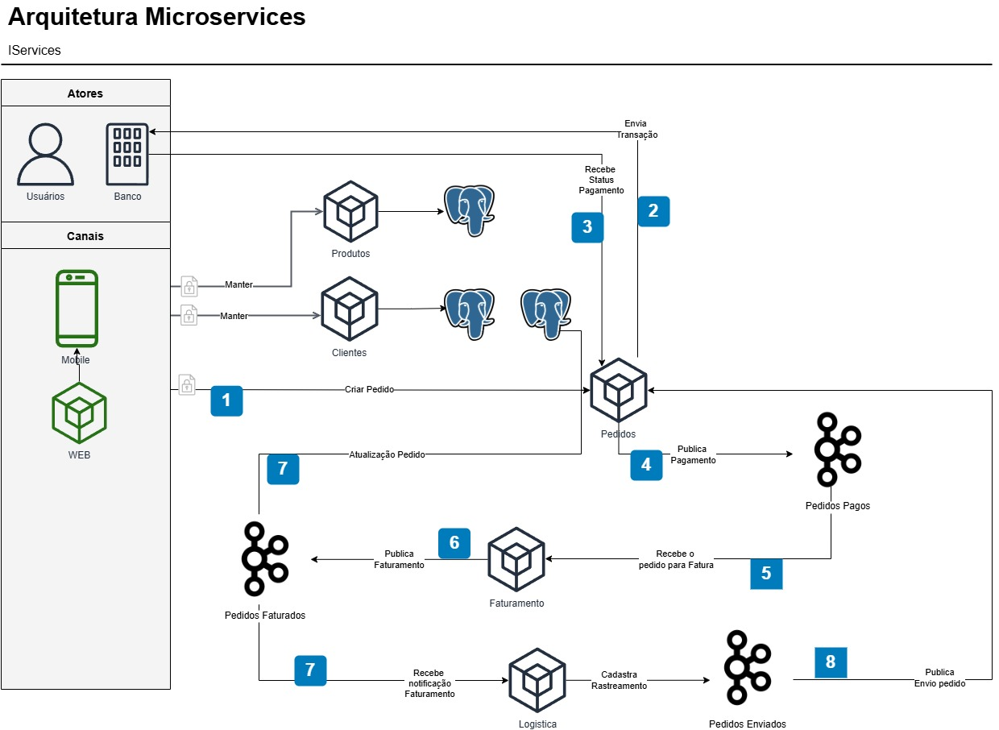

# iCompras

Sistema de e-commerce orientado a eventos, construído com **Spring Boot** e **Apache Kafka**, que processa pedidos em tempo real: pagamento, faturamento (emissão de nota fiscal) e envio (logística), com atualização de status ponta a ponta.

Este README dá a visão geral da arquitetura e o passo a passo de configuração do ambiente. Cada microsserviço também tem seu próprio README com detalhes específicos:

---

## 1. Visão geral da arquitetura



O sistema é composto por **5 microsserviços de negócio** e **3 peças de infraestrutura** (Kafka, PostgreSQL e MinIO), todas provisionadas via Docker Compose dentro da pasta `icompras-servicos`.

### Microsserviços

| Serviço | Porta | Responsabilidade | Banco de dados |
|---|---|---|---|
| **clientes** | `8082` | CRUD de clientes | `icomprasclientes` |
| **produtos** | `8081` | CRUD de produtos | `icomprasprodutos` |
| **pedidos** | `8080` | Orquestra a criação do pedido, valida cliente/produtos, simula pagamento e recebe o callback de pagamento | `icompraspedidos` |
| **faturamento** | `8083` | Consome pedidos pagos, gera a nota fiscal (PDF via JasperReports) e a envia para o bucket | — (usa MinIO) |
| **logística** | `8084` | Consome pedidos faturados, gera o código de rastreio e publica o envio | — |

### Fluxo de eventos (Kafka)

1. O serviço **pedidos** cria o pedido, valida cliente e produtos via chamadas HTTP (Feign) aos serviços **clientes** e **produtos**, e simula uma solicitação de pagamento.
2. Quando o pagamento é confirmado (via callback HTTP), **pedidos** publica no tópico `icompras.pedidos-pagos`.
3. O serviço **faturamento** consome esse tópico, gera a nota fiscal em PDF, faz upload para o bucket MinIO `icompras.faturas` e publica no tópico `icompras.pedidos-faturados`.
4. O serviço **logística** consome `icompras.pedidos-faturados`, gera um código de rastreio e publica no tópico `icompras.pedidos-enviados`.
5. O serviço **pedidos** também escuta `icompras.pedidos-faturados` e `icompras.pedidos-enviados` para manter o status do pedido atualizado (`REALIZADO` → `PAGO` → `FATURADO` → `ENVIADO`, ou `ERRO_PAGAMENTO`).

### Tópicos Kafka utilizados

| Tópico | Produtor | Consumidor(es) |
|---|---|---|
| `icompras.pedidos-pagos` | pedidos | faturamento |
| `icompras.pedidos-faturados` | faturamento | pedidos, logistica |
| `icompras.pedidos-enviados` | logistica | pedidos |

---

## 2. Tecnologias

- Java 21
- Spring Boot 4.x (Web, Data JPA, Kafka, OpenFeign)
- Apache Kafka (Confluent Platform) + Kafka UI (provectuslabs)
- PostgreSQL
- MinIO (armazenamento de objetos compatível com S3, usado para guardar os PDFs das notas fiscais)
- JasperReports (geração do PDF da nota fiscal)
- Maven

## 3. Pré-requisitos

Antes de começar, tenha instalado:

- **Java 21** (JDK)
- **Maven** (ou use o `mvnw` incluso em cada módulo)
- **Docker** e **Docker Compose**

---

## 4. Como subir o ambiente (passo a passo)

Siga esta ordem. Os arquivos de infraestrutura ficam em `icompras-servicos/broker`, `icompras-servicos/bucket` e `icompras-servicos/database`.

### Passo 1 — Subir o banco de dados (PostgreSQL)

```bash
cd icompras-servicos/database
docker compose up -d
```

Isso sobe um PostgreSQL na porta `5555` e cria os bancos `icomprasprodutos`, `icomprasclientes` e `icompraspedidos` (usuário `postgres`, senha `postgres`).

> Execute o script `schema.sql` dessa mesma pasta contra o banco (via `psql`, DBeaver, IntelliJ etc.) para criar as tabelas `produtos`, `clientes`, `pedido` e `item_pedido` antes de iniciar os serviços.

### Passo 2 — Subir o Kafka

```bash
cd icompras-servicos/broker
docker compose up -d
```

Isso sobe o Zookeeper, o Kafka (porta `29092` para acesso externo) e o **Kafka UI** em `http://localhost:8090`.

### Passo 3 — Criar os tópicos no Kafka UI ⚠️ (etapa manual obrigatória)

Os serviços **não criam os tópicos automaticamente**. Você precisa criá-los manualmente antes de rodar o fluxo completo:

1. Acesse o Kafka UI em **http://localhost:8090**.
2. Selecione o cluster `local`.
3. No menu lateral, clique em **Topics** → **Add a Topic** (ou **Create Topic**).
4. Crie os três tópicos abaixo, um de cada vez, com **1 partição** cada (os demais campos podem ficar no valor padrão):

| Nome do tópico | Number of partitions |
|---|---|
| `icompras.pedidos-pagos` | `1` |
| `icompras.pedidos-faturados` | `1` |
| `icompras.pedidos-enviados` | `1` |

5. Clique em **Create Topic** para cada um. Ao final, os três tópicos devem aparecer na listagem de Topics.

### Passo 4 — Subir o MinIO (armazenamento das notas fiscais)

```bash
cd icompras-servicos/bucket
docker compose up -d
```

Isso sobe o MinIO com:
- API em `http://localhost:9000`
- Console web em `http://localhost:9001`
- Usuário: `minioadmin` / Senha: `minioadmin123`

### Passo 5 — Criar o bucket no MinIO ⚠️ (etapa manual obrigatória)

O serviço **faturamento** espera que o bucket já exista. Crie-o manualmente:

1. Acesse o console do MinIO em **http://localhost:9001**.
2. Faça login com `minioadmin` / `minioadmin123`.
3. Clique em **Buckets** no menu lateral → **Create Bucket**.
4. Informe o nome do bucket: **`icompras.faturas`**.
5. Clique em **Create Bucket**.

### Passo 6 — Rodar os microsserviços

Com a infraestrutura no ar e os tópicos/bucket criados, inicie cada serviço.

> Cada serviço já vem com as configurações de conexão (banco, Kafka, MinIO, URLs dos outros serviços) definidas em `src/main/resources/application.properties`, apontando para `localhost` nas portas padrão descritas acima. Ajuste esses valores se você alterar alguma porta na infraestrutura.

---

## 6. Estrutura do repositório

```
icompras-microservices/
├── arquitetura ms com kafka.jpg     # diagrama de arquitetura
├── clientes/                        # microsserviço de clientes
├── produtos/                        # microsserviço de produtos
├── pedidos/                         # microsserviço de pedidos (orquestrador)
├── faturamento/                     # microsserviço de faturamento / notas fiscais
├── logistica/                       # microsserviço de logística / envio
└── icompras-servicos/                # infraestrutura (docker-compose: Kafka, MinIO, Postgres)
    ├── broker/                       # Kafka + Zookeeper + Kafka UI
    ├── bucket/                       # MinIO
    └── database/                     # PostgreSQL + schema.sql
```
